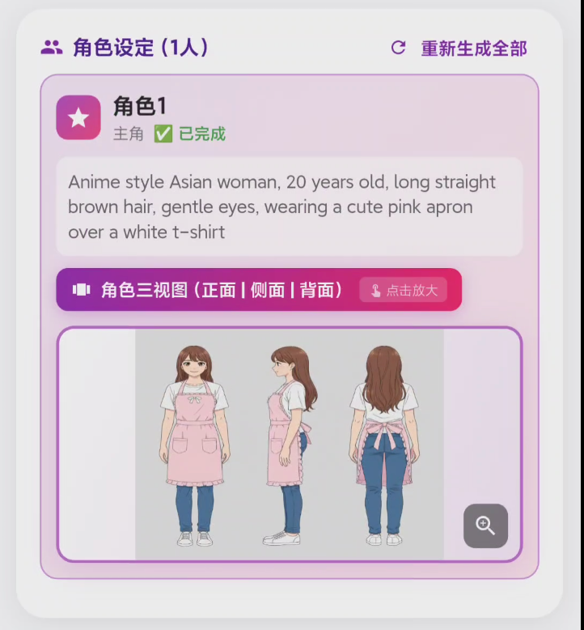
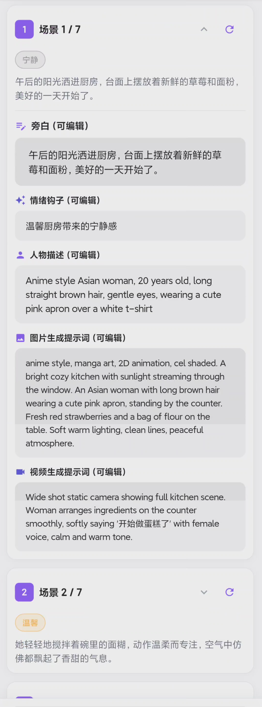
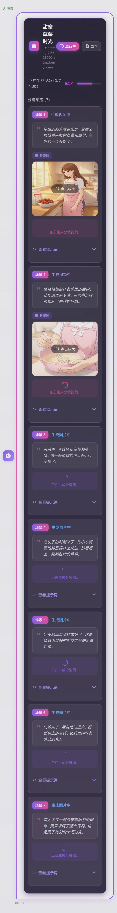

# 🎬 AI漫导 (DirectorAI)

> AI 漫剧制作 APP，能一键生成剧本、分镜及合成视频，让你在手机上也能快速制作漫剧

<p align="center">
  
  
  
  
</p>

## ✨ 项目简介

AI漫导是一款基于 Flutter 开发的移动应用，采用 **AI 智能体架构**，能够理解用户的文字描述，并自动编排多个 AI 模型协作，最终生成完整的AI 漫剧视频内容。

只需简单描述你的创意，AI漫导就能帮你实现！

```
用户: "制作一个雪地里的冒险故事"
     ↓
🤖 AI 理解需求 → 🔥 生成剧本 → 🖼️ 生成分镜图片和视频 → 🎬 转换合成视频
     ↓
✅ 完成！
```


我总结了一下大概的流程是这样子的：


其中，我比较关心的是人物一致性解决方案：


在对应场景的配置默认是给了 7 个，角色是给了 2 个，然后这些我都设置成可配置的了。


能够生成角色三视图：



剧本场景：


场景规划：



场景执行：



场景分镜规划：


## 🛠️ 技术架构

### 核心技术栈

| 技术 | 用途 |
|------|------|
| **Flutter 3.0+** | 跨平台 UI 框架 |
| **Dart 3.0+** | 编程语言 |
| **Provider** | 状态管理 |
| **Dio** | HTTP 网络请求 |
| **flutter_markdown** | Markdown 渲染 |

### AI 模型集成

| 模型 | 提供商 | 功能 |
|------|--------|------|
| **GLM-4.7** | 智谱 AI | 智能编排与决策 |
| **Gemini-3-Pro-Image-Preview** | Google | 文本生成图片 |
| **Veo3.1** | Google | 图片生成视频 |

### 智能体架构

项目采用 **ReAct (Reasoning + Acting)** 循环架构：

```
┌─────────────────────────────────────────────────────┐
│                    ReAct 循环                        │
├─────────────────────────────────────────────────────┤
│  1. 用户输入 → GLM-4.7 理解意图                      │
│  2. GLM 返回下一步操作 (JSON 命令)                   │
│  3. 执行工具调用 (图片生成 / 视频生成)               │
│  4. 将结果反馈给 GLM                                 │
│  5. 重复直到任务完成                                 │
└─────────────────────────────────────────────────────┘
```

## 📁 项目结构

```
lib/
├── main.dart                 # 应用入口，主题配置
├── controllers/
│   └── agent_controller.dart # ReAct 智能体控制器
├── models/
│   ├── agent_command.dart    # 智能体命令/响应模型
│   └── chat_message.dart     # 聊天消息模型
├── providers/
│   └── chat_provider.dart    # 聊天状态管理
├── screens/
│   └── chat_screen.dart      # 主聊天界面
└── services/
    └── api_service.dart      # API 服务层
```

## 🚀 快速开始

### 环境要求

- Flutter SDK >= 3.0.0
- Dart SDK >= 3.0.0
- Android Studio / VS Code
- Android 设备或模拟器

### 安装步骤

1. **克隆项目**
   ```bash
   git clone <repository-url>
   cd director_ai
   ```

2. **安装依赖**
   ```bash
   flutter pub get
   ```

3. **配置 API Token**
   
   在 `lib/services/api_service.dart` 中配置你的智谱 AI API Token：
   ```dart
   static String bearerToken = 'YOUR_API_TOKEN';
   ```
   
   或在应用设置中动态配置。

4. **运行应用**
   ```bash
   flutter run
   ```

## 📦 依赖说明

```yaml
dependencies:
  flutter: sdk
  cupertino_icons: ^1.0.6    # iOS 风格图标
  dio: ^5.4.0                # HTTP 客户端
  provider: ^6.1.1           # 状态管理
  path_provider: ^2.1.5      # 文件路径访问
  flutter_markdown: ^0.6.18+3 # Markdown 渲染
  http_parser: ^4.0.2        # HTTP 解析工具
```

## 🎨 UI 特点

- 🌸 **二次元粉色主题** - 可爱清新的视觉风格
- 💬 **聊天界面** - 自然的对话交互体验
- 🎭 **Material Design 3** - 现代化设计语言
- 📱 **响应式布局** - 适配不同屏幕尺寸

## 🔧 可用工具

智能体可调用以下工具：

| 工具名称 | 参数 | 功能描述 |
|----------|------|----------|
| `generate_image` | `prompt` | 根据文字描述生成图片 |
| `generate_video` | `image_url`, `prompt`, `seconds` | 将图片转换为视频 |
| `complete` | `message` | 完成任务并回复用户 |

## 📝 使用示例

**示例 1: 创建简单视频**
```
你: 做一个日落的视频
AI: 正在生成日落图片...
AI: 图片生成成功！
AI: 正在将图片转换为视频...
AI: 你的视频已准备好了！
```

**示例 2: 详细描述**
```
你: 制作一个樱花树下，女孩在读书的唯美视频，10秒
AI: 正在生成唯美场景图片...
AI: 正在创建10秒视频...
AI: 完成！希望你喜欢这个视频！
```

## ⚙️ 配置选项

### API 配置

在 `ApiConfig` 类中可配置：

```dart
class ApiConfig {
  static const String baseUrl = 'https://open.bigmodel.cn/api/paas/v4';
  static String bearerToken = 'YOUR_TOKEN';
}
```

### 智能体配置

在 `AgentController` 中可调整：

```dart
// 最大迭代次数，防止无限循环
static const int _maxIterations = 10;
```

## 🌟 API 使用教程

### 推荐：使用苍何 API

本项目推荐使用 **苍何 API** (https://api.canghe.ai/) 来调用各种 AI 模型。苍何 API 提供了稳定、高性能的 AI 服务接口，支持多种主流模型。

### 获取 API Token

1. 访问 [https://api.canghe.ai/](https://api.canghe.ai/)
2. 注册账号并登录
3. 在控制台中创建 API Token
4. 复制你的 Token 备用

### 配置 API Token

#### 方法一：代码中配置（开发测试）

在 `lib/services/api_service.dart` 中设置你的 Token：

```dart
class ApiConfig {
  // 推荐使用苍何 API
  static const String baseUrl = 'https://api.canghe.ai/v1';
  static String bearerToken = 'YOUR_CANGHE_API_TOKEN';
}
```

#### 方法二：应用内设置（推荐）

1. 运行应用后，进入设置界面
2. 找到 "API 配置" 选项
3. 输入你的苍何 API Token
4. 保存配置即可使用

### 支持的模型

苍何 API 支持多种 AI 模型，包括：

| 模型类型 | 模型名称 | 功能 |
|---------|---------|------|
| 文本对话 | GLM-4.7, GPT-4, Claude | 智能对话与决策 |
| 图像生成 | DALL-E, Stable Diffusion, Gemini | 文本转图片 |
| 视频生成 | Veo, Runway | 图片转视频 |

### API 调用示例

```dart
import 'package:dio/dio.dart';

class CangheApiService {
  final Dio _dio = Dio();
  final String _apiKey = 'YOUR_CANGHE_API_TOKEN';
  final String _baseUrl = 'https://api.canghe.ai/v1';

  // 调用对话模型
  Future<String> chat(String message) async {
    try {
      final response = await _dio.post(
        '$_baseUrl/chat/completions',
        options: Options(
          headers: {
            'Authorization': 'Bearer $_apiKey',
            'Content-Type': 'application/json',
          },
        ),
        data: {
          'model': 'glm-4.7',
          'messages': [
            {'role': 'user', 'content': message}
          ],
        },
      );
      return response.data['choices'][0]['message']['content'];
    } catch (e) {
      throw Exception('API 调用失败: $e');
    }
  }

  // 生成图片
  Future<String> generateImage(String prompt) async {
    try {
      final response = await _dio.post(
        '$_baseUrl/images/generations',
        options: Options(
          headers: {
            'Authorization': 'Bearer $_apiKey',
            'Content-Type': 'application/json',
          },
        ),
        data: {
          'model': 'dall-e-3',
          'prompt': prompt,
          'n': 1,
          'size': '1024x1024',
        },
      );
      return response.data['data'][0]['url'];
    } catch (e) {
      throw Exception('图片生成失败: $e');
    }
  }
}
```

### 费用说明

- 苍何 API 采用按使用量计费的方式
- 新用户注册即可获得免费额度用于测试
- 详细价格请访问官网查看：https://api.canghe.ai/pricing

### 常见问题

**Q: API Token 在哪里查看？**
A: 登录苍何 API 控制台，在 "API 密钥" 页面可以查看和管理你的 Token。

**Q: 如何查看 API 使用量？**
A: 在控制台的 "使用统计" 页面可以查看详细的调用记录和费用明细。

**Q: API 调用失败怎么办？**
A: 请检查：
1. Token 是否正确配置
2. 账户余额是否充足
3. 网络连接是否正常
4. 查看官方文档获取错误代码说明

## 🔒 安全提示

⚠️ **重要**：不要将 API Token 提交到版本控制系统！

建议：
- 使用环境变量存储敏感信息
- 在生产环境中使用后端代理 API 调用
- 考虑使用 Flutter secure storage 存储 token
- 定期更换 API Token 以提高安全性

## 🤝 贡献指南

欢迎提交 Issue 和 Pull Request！

1. Fork 本项目
2. 创建特性分支 (`git checkout -b feature/AmazingFeature`)
3. 提交更改 (`git commit -m 'Add some AmazingFeature'`)
4. 推送到分支 (`git push origin feature/AmazingFeature`)
5. 提交 Pull Request

## star 趋势图

[](https://star-history.com/#freestylefly/director_ai&Date)

## 公众号

微信搜 **苍何** 或扫描下方二维码关注苍何的原创公众号，回复 **AI** 即可和 18000+ 好友一同探讨AI，一同学习 AI Coding。


## 📄 许可证

本项目采用 MIT 许可证 - 查看 [LICENSE](LICENSE) 文件了解详情。

---

<p align="center">
  Made with ❤️ and Flutter
</p>

